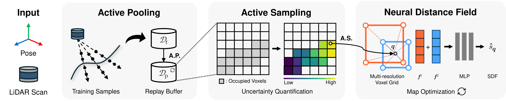

<div align="center">
<h1 align="center">LAPS: Improving Incremental LiDAR Mapping using Active Pooling and Sampling for Neural Distance Fields</h1>


<a href="https://arxiv.org/abs/2605.15496" target="_blank" rel="noopener noreferrer"></a>
<a href="https://ieeexplore.ieee.org/document/11543268" target="_blank" rel="noopener noreferrer"></a>

<p>
  <span class="author"><a href="https://dongjae0107.github.io/">Dongjae Lee</a><sup>1</sup></span> ·
  <span class="author"><a href="https://scholar.google.com/citations?user=lh2KUKMAAAAJ&hl=en&oi=ao">Wooseong Yang</a><sup>1</sup></span> ·
  <span class="author"><a href="https://yifutao.github.io/">Yifu Tao</a><sup>2</sup></span> ·
  <span class="author"><a href="https://scholar.google.com/citations?user=BqV8LaoAAAAJ&hl=en">Maurice Fallon</a><sup>2</sup></span> ·
  <span class="author"><a href="https://scholar.google.com/citations?user=7yveufgAAAAJ&hl=en">Ayoung Kim</a><sup>1</sup></span>
</p>

<sup>1</sup>[RPM Robotics Lab, Seoul National University](https://rpm.snu.ac.kr/); <sup>2</sup>[Dynamic Robot Systems Group, University of Oxford](https://dynamic.robots.ox.ac.uk/)
</div>

## TL;DR
LAPS improves incremental neural LiDAR mapping by actively managing replay samples under a fixed memory and training budget.
It consists of two key components: **Reliability-based Active Pooling**, which retains reliable replay samples while reducing spatial imbalance, and **Uncertainty-guided Active Sampling**, which allocates online training samples based on uncertainty.

<p align="center">
  
</p>
<p align="center">
  <em>Overview of the LAPS pipeline.</em>
</p>

## Updates
- **[June, 2026]**: Code released.
- **[May, 2026]**: LAPS was accepted to IEEE Robotics and Automation Letters (RA-L)!

## Installation
### 0. Clone the repository
```bash
git clone https://github.com/dongjae0107/LAPS.git
```

### 1. Set up conda environment
```bash
conda create -n laps python=3.10
conda activate laps
```

### 2. Install PyTorch
```bash
conda install pytorch==2.5.1 torchvision==0.20.1 torchaudio==2.5.1 pytorch-cuda=12.1 -c pytorch -c nvidia
```
For different CUDA or PyTorch versions, please refer to the official [PyTorch installation guide](https://pytorch.org/get-started/previous-versions/).

### 3. Install additional dependencies
```bash
python -m pip install matplotlib open3d scikit-image tabulate
conda install -c conda-forge quaternion
```

## Download Datasets
Please download the datasets and organize them as follows:
```
LAPS/
└── dataset/
    ├── maicity/
    ├── ncd/
    └── spires/
```

### MaiCity Dataset
Download the dataset from [here](https://www.ipb.uni-bonn.de/data/mai-city-dataset/index.html) or use the following script:
```bash
cd dataset/scripts/
bash download_maicity.sh
```

### Newer College Dataset
Download the dataset from [here](https://ori-drs.github.io/newer-college-dataset/download/).

### Oxford Spires Dataset
Download the dataset from [here](https://dynamic.robots.ox.ac.uk/datasets/oxford-spires/).

## Running LAPS
Run LAPS with the corresponding configuration file:
```bash
# MaiCity
python run.py config/maicity/maicity.yaml

# Newer College
python run.py config/ncd/ncd.yaml

# Oxford Spires
python run.py config/spires/blenheim_palace.yaml # [blenheim_palace, christ_church, keble_college, observatory_quarter]
```

## Citation
If you use this code or find our work useful for your research, please consider citing:
```bibtex
@article{lee2026laps,
  title={LAPS: Improving Incremental LiDAR Mapping using Active Pooling and Sampling for Neural Distance Fields},
  author={Lee, Dongjae and Yang, Wooseong and Tao, Yifu and Fallon, Maurice and Kim, Ayoung},
  journal={IEEE Robotics and Automation Letters},
  year={2026},
  volume={11},
  number={7},
  pages={8584-8591},
  doi={10.1109/LRA.2026.3699255}
}
```

## Acknowledgements
This codebase builds on ideas and implementations from the following excellent works:
- [SHINE_mapping](https://github.com/PRBonn/SHINE_mapping)
- [PIN_SLAM](https://github.com/PRBonn/PIN_SLAM)
- [4dNDF](https://github.com/PRBonn/4dNDF)
- [N3-Mapping](https://github.com/tiev-tongji/N3-Mapping)
- [SiLVR](https://github.com/ori-drs/silvr)
- [Bayes'Rays](https://github.com/BayesRays/BayesRays)